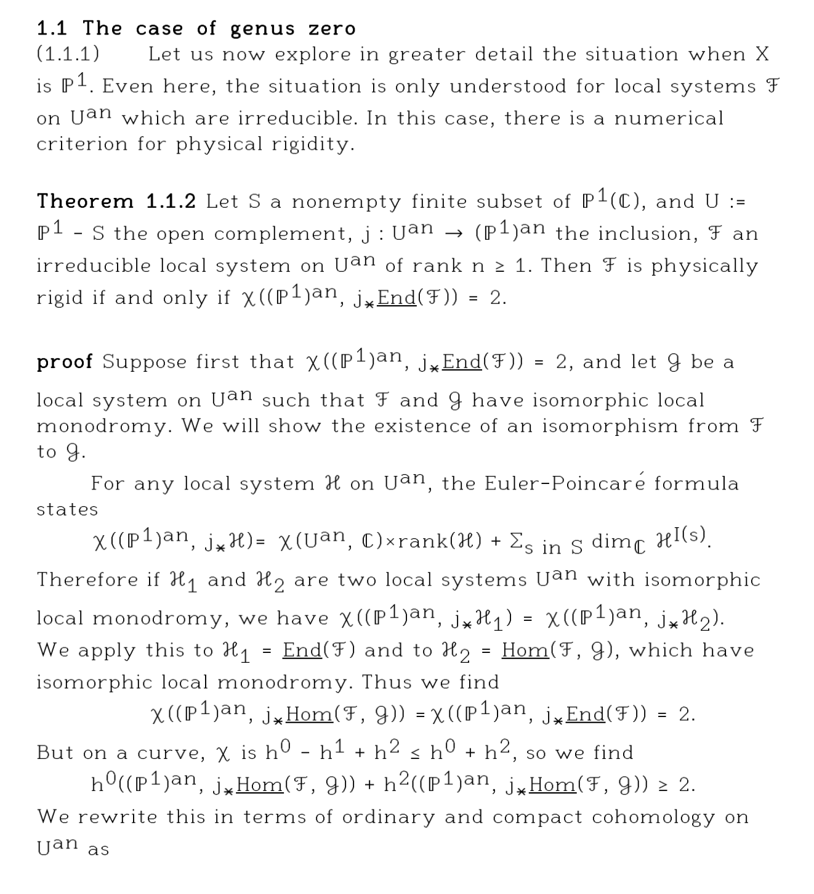
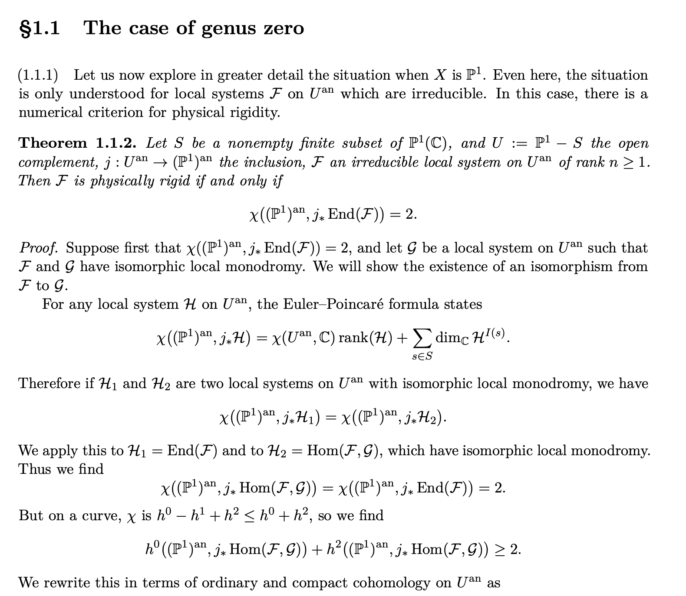

<div align="center">

# Retypeset

### Turn document references into polished, editable LaTeX.

An AI-agent skill for recreating scans, photos, and PDFs as visually faithful LaTeX projects.


[](LICENSE)

[Quick start](#quick-start) · [How it works](#how-it-works) · [Example prompt](#example-prompt) · [Compatibility](#compatibility)

</div>

---

## Why Retypeset?

Most document conversions optimize for text extraction. Retypeset optimizes for the finished page: its hierarchy, spacing, columns, tables, headers, footers, and overall typographic character.

It tells an agent to:

- preserve source wording unless an edit is requested;
- build real LaTeX structure instead of using a page image as a shortcut;
- return editable `.tex` source, not only a PDF; and
- compile and compare the result with the reference whenever the environment allows it.

## Before & after

<p align="center">
  
  
</p>

<p align="center"><em>Reference scan (left) → editable LaTeX reconstruction (right)</em></p>

## Quick start

Clone the skill repository:

```bash
git clone git@github.com:yunhaixiang/retypeset-skill.git
```

Then use the integration your agent supports:

| Agent setup | Use it this way |
| --- | --- |
| Codex | Register the repository as a `SKILL.md` skill. |
| Claude Code | Install the repository as a custom `SKILL.md` skill. |
| Cursor | Keep the repository in the project so Cursor reads the root [`AGENTS.md`](AGENTS.md). |
| Other project-instruction agents | Copy [`SKILL.md`](SKILL.md) into the agent's instruction file. |
| Chat based | Attach or paste [`SKILL.md`](SKILL.md) together with the reference document. |

Codex and Claude Code use the canonical [`SKILL.md`](SKILL.md); Cursor reads [`AGENTS.md`](AGENTS.md), which points back to the same instructions.

## How it works

```text
Reference document
       │
       ▼
Inspect layout and extract text
       │
       ▼
Build semantic, editable LaTeX
       │
       ▼
Compile and render
       │
       ▼
Compare with the reference and refine
```

The agent selects the LaTeX engine based on the document's actual needs, keeps dependencies practical, and records any nonstandard build requirement.

## Example prompt

> Use the Retypeset skill to recreate the attached document as a LaTeX project. Preserve the text and page layout. Use `main.tex` as the entry point, compile it, and include the compiled PDF for comparison. Flag any text that cannot be read reliably.

For the most faithful result, supply every page of the source and specify any required document class, TeX engine, fonts, bibliography format, or allowed OCR cleanup.

## Expected output

For a multi-file document, a typical result looks like this:

```text
document-name/
├── main.tex        # Editable LaTeX entry point
├── figures/        # Original artwork that cannot be recreated natively
├── main.pdf        # Compiled preview, when compilation is available
└── README.md       # Build instructions, only when nonstandard steps are needed
```

The `.tex` source is the primary deliverable. The PDF is a verification artifact, not a substitute for editable source.

## Compatibility

Retypeset is intentionally tool-neutral. Any capable AI agent that can read Markdown instructions and work with the supplied files can use it.

Visual verification requires both a LaTeX compiler and a way to render PDFs. If either is unavailable, the agent should still produce the source and clearly disclose that it could not verify the compiled visual result.

## Repository layout

```text
.
├── SKILL.md            # Canonical skill instructions
├── AGENTS.md           # Project-instruction discovery entry
├── assets/              # README example images
└── agents/openai.yaml  # Optional Codex/OpenAI UI metadata
```

## Contributing

The skill's behavior lives in [`SKILL.md`](SKILL.md). Keep changes focused on guidance that improves document-to-LaTeX fidelity or makes the workflow more reliable across agent environments.

## License

Distributed under the [MIT License](LICENSE).
